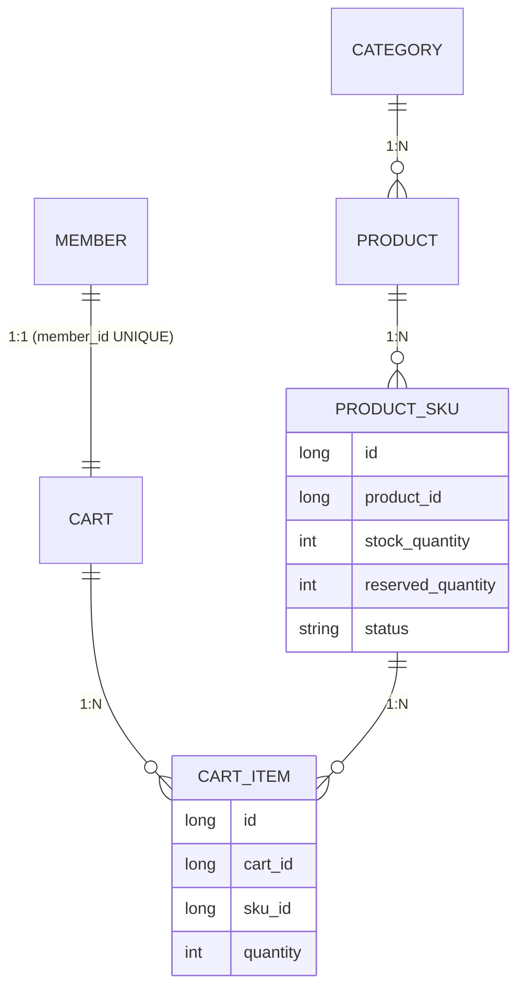

> 주문 동시성 문제 해결기 (3/7)
{: .prompt-tip }

## 현재 상태

### 시리즈에서 다루는 문제

2편에서 fetch join 조회에 FOR UPDATE를 걸고, SKU id 오름차순 정렬로 데드락(문제 A)을 피했다고 봤다. 하지만 그건 정렬된 결과 순서를 확인한 것이지, 실제로 락이 그 순서대로 걸리는지를 확인한 건 아니었다.   
남은 건 두 가지다. 이 정렬이 정말 락 순서에 관여하는지(문제 A), 그리고 조인된 products까지 락이 번지는지(문제 B).  
[2편 - 문제 A. 락의 획득 순서로 인한 데드락 위험]()


### 이 글에서 다루는 것

두 문제를 실측하려면 먼저 검증할 데이터가 있어야 한다. 이 글은 그 사전 준비로, 락 범위 확산을 재현할 더미데이터를 만드는 SQL 스크립트를 다룬다. 핵심은 "같은 Product에 속한 여러 SKU"를 따로 두어, 서로 다른 SKU를 주문할 때 같은 products 행에서 경합이 나는 상황을 재현하는 것이다.   
실측 자체(EXPLAIN, performance_schema)는 다음 글에서 이 데이터를 가지고 진행한다.


### 환경

Spring Boot 3.x / JPA(Hibernate) / QueryDSL / MySQL 8.0 (InnoDB, REPEATABLE READ)

---

## 스크립트 전체 구조

```
1. 기존 category_id / member_id 확보 (하드코딩 금지)
2. products 대량 생성 (약 500건, status를 ACTIVE/ARCHIVED 섞어서)
3. product_skus 대량 생성 (상품당 색상 3종 → 약 1,500건)
4. 검증 대상이 될 특정 상품 1건 + SKU 4건 명시적 생성 (동일 상품, 다른 SKU 시나리오)
5. user1의 cart 확보(없으면 생성) + 위 SKU 4건을 cart_items로 추가
6. 결과 cart_item id 조회 → EXPLAIN 쿼리의 IN(...)에 대입
```

### 테이블간 관계
이 스크립트가 만드는 데이터는 아래 구조를 따른다(1편에서 세운 관계와 같다). 핵심은 Product 하나에 ProductSku가 여럿 달리는 1:N이며, 이번 더미데이터의 "검증대상 의자 1건 + SKU 4건"이 바로 그 형태다.

```text
Category
  └─ Product (상품)
       └─ ProductSku (색상·재질별 판매 단위, 재고 보유)   ← 1:N
Member
  └─ Cart (회원당 1개, member_id UNIQUE)
       └─ CartItem (담은 SKU + 수량)   → ProductSku 참조
```



---

### 0. 사전 확인 (하드코딩 금지)

- 둘 중 하나라도 NULL이 나오면 시딩 순서 문제이니 여기서 멈추고 원인부터 확인 필요
- 시딩(seeding) 순서:
    - 테스트·개발용 초기 데이터를 DB에 채워 넣는 순서
    - 테이블 간에 외래키(FK) 의존이 있어 순서가 중요함
    - 먼저 있어야 하는 것부터 채우는 순서
- 프로젝트 구조
    - 뒤 테이블이 앞 테이블의 id를 참조
    - `categories` → `products` → `product_skus`
    - `members` → `carts` → `cart_items`

```sql
SET @leaf_category_id = (SELECT id FROM categories WHERE name = '식탁 의자' LIMIT 1);
SET @user1_id = (SELECT id FROM members WHERE email = 'user1@test.com' LIMIT 1);

SELECT @leaf_category_id AS category_check, @user1_id AS member_check;
```

### 1. products 대량 생성

- MySQL 재귀 CTE: `cte_max_recursion_depth`(기본값 1000)를 넘으면 에러 발생
    - 500건 정도는 기본값 안에서 안전하게 처리되니 우선 이 정도로 시작
    - 더 필요하면 `SET SESSION cte_max_recursion_depth = 10000;`으로 올림
- `status`를 전부 `ACTIVE`로 채우면 안 되는 이유
    - 쿼리의 `product.status.ne(ARCHIVED)` 조건은 대상 row가 사실상 100%에 가까우면 옵티마이저 입장에서 걸러내는 의미가 없는 조건이 됨
    - 최소한 일부라도 `ARCHIVED`를 섞어야 이 필터 조건이 실제로 뭔가를 거르는 조건으로 작동하고, EXPLAIN에서 의미 있는 관찰 가능

```sql
INSERT INTO products (
    category_id, name, description, product_type, status,
    base_price, weight, width, height, depth,
    created_date, last_modified_date
)
WITH RECURSIVE seq AS (
    SELECT 0 AS n
    UNION ALL
    SELECT n + 1 FROM seq WHERE n < 499   -- 500건
)
SELECT
    @leaf_category_id,
    CONCAT('더미 상품 ', n),
    '더미 데이터 - 락 검증용',
    IF(n % 4 = 0, 'COMPLETE', 'COMPONENT'),
    IF(n % 10 = 0, 'ARCHIVED', 'ACTIVE'),   -- 약 10%를 ARCHIVED로 섞음
    0,
    1.0, 10.0, 10.0, 5.0,
    NOW(), NOW()
FROM seq;
```

### 2. product_skus 대량 생성 (상품당 3색상)

```sql
INSERT INTO product_skus (
    product_id, price, stock_quantity, reserved_quantity, status, color, material,
    created_date, last_modified_date
)
SELECT
    p.id,
    10000 + (p.id % 20) * 1000,
    100,
    0,
    IF(p.id % 15 = 0, 'DISCONTINUED', 'ACTIVE'),
    c.color,
    c.material,
    NOW(), NOW()
FROM products p
CROSS JOIN (
    SELECT '블랙' AS color, '원목' AS material
    UNION ALL SELECT '화이트', '패브릭'
    UNION ALL SELECT '그레이', '메탈'
) c
WHERE p.description = '더미 데이터 - 락 검증용';
```

### 3. 검증 대상 상품 1건 + SKU 4건 (명시적으로)

- "동일 Product에 속한 여러 SKU를 서로 다른 트랜잭션이 주문하려 할 때 Product row 락 경합이 생긴다" → 이 시나리오를 직접 재현할 대상
- 대량 데이터 속에서 임의로 고르지 않고, 이름으로 바로 찾을 수 있게 따로 만듦

```sql
INSERT INTO products (
    category_id, name, description, product_type, status,
    base_price, weight, width, height, depth,
    created_date, last_modified_date
) VALUES (
    @leaf_category_id, '검증대상 의자', '락 검증 타겟 상품', 'COMPLETE', 'ACTIVE',
    0, 5.0, 45.0, 90.0, 50.0,
    NOW(), NOW()
);

SET @target_product_id = LAST_INSERT_ID();

INSERT INTO product_skus (
    product_id, price, stock_quantity, reserved_quantity, status, color, material,
    created_date, last_modified_date
) VALUES
    (@target_product_id, 89000, 50, 0, 'ACTIVE', '블랙', '패브릭', NOW(), NOW()),
    (@target_product_id, 89000, 50, 0, 'ACTIVE', '화이트', '패브릭', NOW(), NOW()),
    (@target_product_id, 95000, 50, 0, 'ACTIVE', '그레이', '가죽', NOW(), NOW()),
    (@target_product_id, 95000, 50, 0, 'ACTIVE', '베이지', '가죽', NOW(), NOW());
```

### 4. user1의 cart 확보 + cart_items 추가

```sql
-- cart가 없으면 생성 (Cart.memberId는 UNIQUE)
INSERT INTO carts (member_id, created_date, last_modified_date)
SELECT @user1_id, NOW(), NOW()
WHERE NOT EXISTS (SELECT 1 FROM carts WHERE member_id = @user1_id);

SET @cart_id = (SELECT id FROM carts WHERE member_id = @user1_id);

INSERT INTO cart_items (cart_id, sku_id, quantity, created_date, last_modified_date)
SELECT @cart_id, ps.id, 1, NOW(), NOW()
FROM product_skus ps
WHERE ps.product_id = @target_product_id;
```

### 5. 통계 갱신 + EXPLAIN에 넣을 실제 값 확인

```sql
ANALYZE TABLE products, product_skus, cart_items, carts;

SELECT ci.id AS cart_item_id, ps.id AS sku_id, ps.product_id, @user1_id AS member_id
FROM cart_items ci
JOIN product_skus ps ON ci.sku_id = ps.id
WHERE ps.product_id = @target_product_id;
```

---

### 정리

락 검증에 쓸 더미데이터를 스크립트로 만들었다. 
- category_id·member_id는 하드코딩하지 않고 조회로 확보해, 시딩 순서가 어긋나면 그 자리에서 멈추도록 했다.
- products는 약 500건을 만들되 일부를 ARCHIVED로 섞었다. status가 전부 ACTIVE면 status <> ARCHIVED 필터가 사실상 아무것도 거르지 않아, 옵티마이저가 이 조건을 무시하는 게 오히려 정상이기 때문이다. 실행 계획에서 이 필터를 의미 있게 관찰하려면 걸러낼 대상이 실제로 있어야 한다.
- 검증 타깃은 대량 데이터에 섞지 않고 "검증대상 의자" 한 건 + SKU 4건으로 따로 심었다. 같은 Product에 SKU 여러 개를 두는 이 구성이, 다음 글에서 확인할 Product 행 경합 시나리오의 데이터이다.
- 마지막에 ANALYZE TABLE로 통계를 갱신하고, EXPLAIN에 넣을 실제 cart_item id·member_id 값을 조회해 뒀다.
   
다음 글에서는 이 데이터로 EXPLAIN과 performance_schema.data_locks를 돌려, 앞서 남겨둔 문제 A와 문제 B가 실제로 어떻게 나타나는지 확인한다.